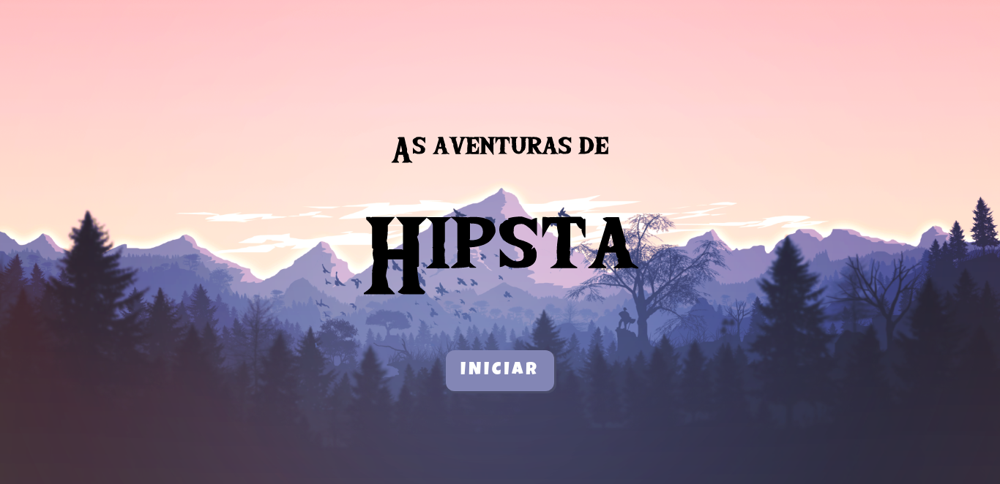
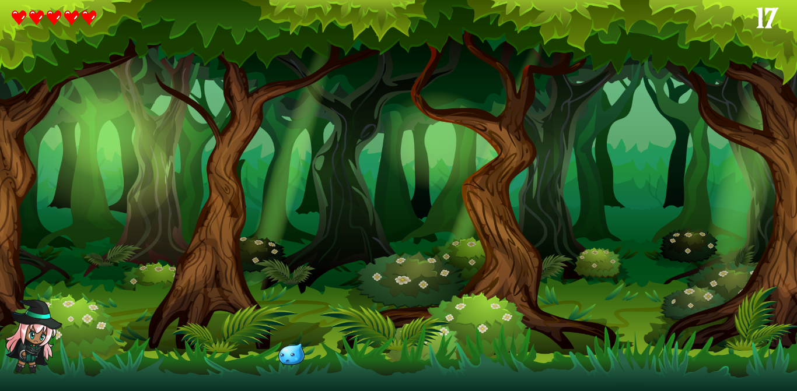
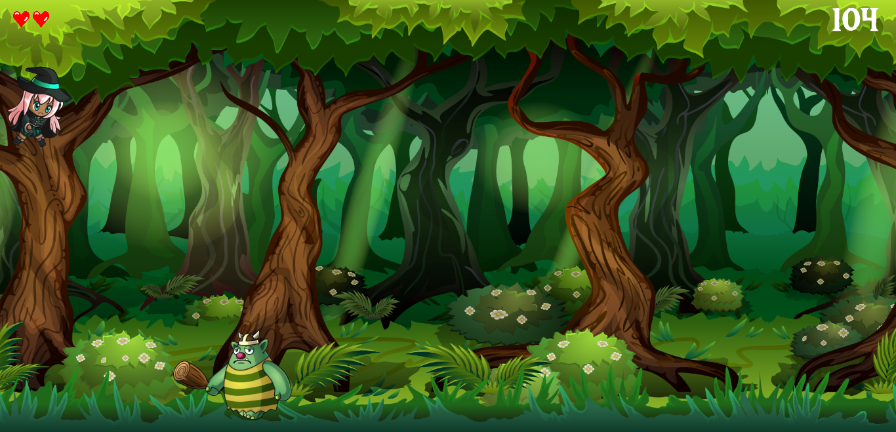
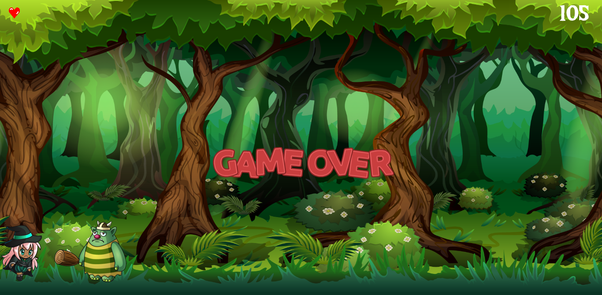

<h3 align="center">#ImersãoGameDev - Alura - Jogo da bruxinha Hipsta</h3>

 

---
 

## 😊 Sobre 
Foram 5 aulas gratuitas para criar um jogo da bruxinha **Hipsta** do zero com **JavaScript** e utilizando uma biblioteca **p5.js** do JS para criar experiências gráficas e interativas, com base nos princípios de Processamento.

 

---
## :computer: Demonstração

 

<h3 align="center">
  
</h3>

<h3 align="center">
  
</h3>

<h3 align="center">
  
</h3>

<h3 align="center">
  
</h3>

 

  <b><a src="https://laughing-jang-8b58e3.netlify.app/">Clique aqui para jogar</a>

 

Desenvolvido com :purple_heart: por  Vanessa Ribeiro Koch

